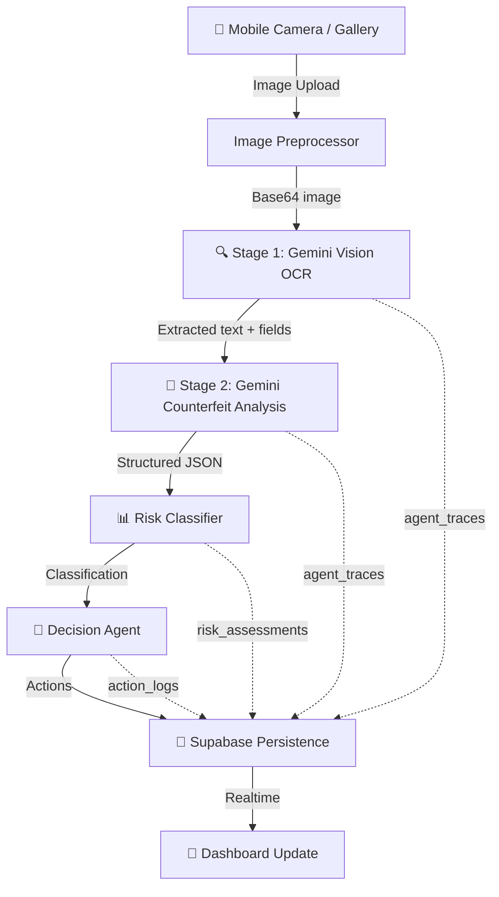
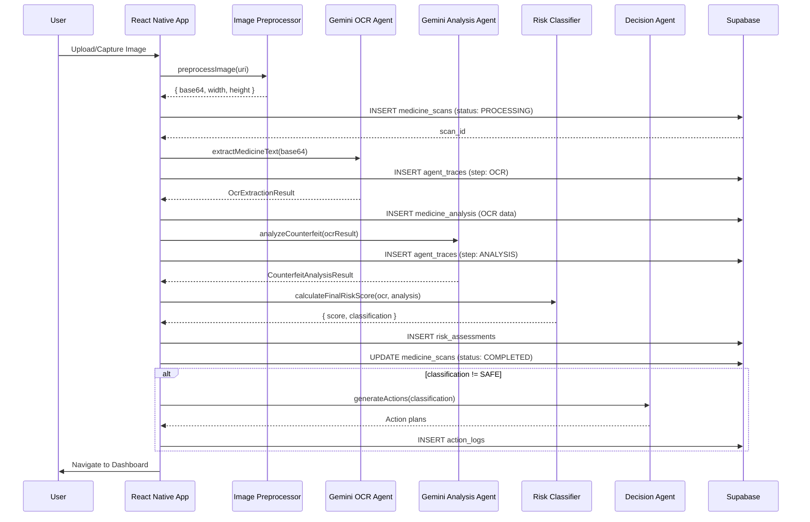

# PharmaGuard AI — OCR + Gemini + Supabase Pipeline Architecture

> [!IMPORTANT]
> This architecture is optimized for **hackathon execution speed**. It uses Gemini's multimodal Vision API for both OCR extraction AND counterfeit analysis, eliminating the need for a separate OCR engine dependency.

---

## 1. Pipeline Architecture Overview



### Pipeline Stages

| Stage | Input | Output | Engine |
|---|---|---|---|
| **Image Capture** | Camera/Gallery | Raw image bytes | `expo-image-picker` |
| **Preprocessing** | Raw image | Base64 string + metadata | Client-side JS |
| **OCR Extraction** | Base64 image | Structured medicine fields | Gemini 2.0 Flash Vision |
| **Counterfeit Analysis** | OCR fields + image | Risk assessment JSON | Gemini 2.0 Flash |
| **Risk Classification** | AI scores | SAFE / SUSPICIOUS / HIGH_RISK / CRITICAL | Local logic |
| **Action Generation** | Classification | Containment action plans | Gemini 2.0 Flash |
| **Persistence** | All outputs | Database records | Supabase |

---

## 2. Image Preprocessing Flow

```typescript
// src/api/imagePreprocessor.ts

import * as ImageManipulator from 'expo-image-manipulator';

export async function preprocessImage(imageUri: string): Promise<{
  base64: string;
  width: number;
  height: number;
  fileSize: number;
}> {
  // Step 1: Resize to max 1024px (saves Gemini tokens + speeds up)
  const manipulated = await ImageManipulator.manipulateAsync(
    imageUri,
    [{ resize: { width: 1024 } }],
    { compress: 0.8, format: ImageManipulator.SaveFormat.JPEG, base64: true }
  );

  return {
    base64: manipulated.base64!,
    width: manipulated.width,
    height: manipulated.height,
    fileSize: Math.round((manipulated.base64!.length * 3) / 4), // approx bytes
  };
}
```

**Why this approach:**
- Resizing to 1024px reduces Gemini API token cost by ~60%
- JPEG compression at 0.8 keeps text readable while reducing payload
- Base64 encoding avoids needing file upload infrastructure

---

## 3. OCR Extraction Strategy (Stage 1)

### Approach: Gemini Vision as OCR Engine

Instead of integrating Tesseract or ML Kit (which add native dependencies and complexity), we send the image directly to **Gemini 2.0 Flash Vision** with a structured extraction prompt.

### Stage 1 Prompt Template

```typescript
const OCR_EXTRACTION_PROMPT = `
You are a pharmaceutical OCR extraction agent for PharmaGuard AI.
Analyze this medicine packaging image and extract ALL visible text fields.

Return a JSON object with EXACTLY this structure:
{
  "raw_text": "complete raw text visible on package",
  "extracted_fields": {
    "medicine_name": "brand name or null",
    "generic_name": "generic/chemical name or null",
    "manufacturer": "manufacturer name or null",
    "batch_number": "batch/lot number or null",
    "serial_number": "serial or tracking number or null",
    "expiry_date": "expiry date in YYYY-MM-DD format or null",
    "manufacturing_date": "mfg date in YYYY-MM-DD format or null",
    "dosage": "dosage info (e.g. '500mg') or null",
    "ndc_code": "NDC or registration number or null",
    "barcode_text": "any barcode numbers visible or null",
    "country_of_origin": "country if visible or null"
  },
  "visual_indicators": {
    "packaging_quality": "HIGH | MEDIUM | LOW",
    "text_clarity": "CLEAR | BLURRY | PARTIALLY_READABLE",
    "color_consistency": "CONSISTENT | INCONSISTENT | FADED",
    "logo_present": true/false,
    "hologram_visible": true/false,
    "seal_intact": true/false
  },
  "ocr_confidence": 0.0-1.0,
  "notes": "any observations about image quality or readability"
}

RULES:
- Extract EXACTLY what you see. Do not guess or fabricate fields.
- If a field is not visible, set it to null.
- Dates must be converted to YYYY-MM-DD format.
- ocr_confidence should reflect text readability (1.0 = perfect).
- Return ONLY valid JSON, no markdown fences.
`;
```

### API Call

```typescript
// src/api/geminiOcr.ts

const GEMINI_API_URL = 'https://generativelanguage.googleapis.com/v1beta/models/gemini-2.0-flash:generateContent';

export async function extractMedicineText(
  base64Image: string,
  apiKey: string
): Promise<OcrExtractionResult> {
  const response = await fetch(`${GEMINI_API_URL}?key=${apiKey}`, {
    method: 'POST',
    headers: { 'Content-Type': 'application/json' },
    body: JSON.stringify({
      contents: [{
        parts: [
          { text: OCR_EXTRACTION_PROMPT },
          {
            inlineData: {
              mimeType: 'image/jpeg',
              data: base64Image
            }
          }
        ]
      }],
      generationConfig: {
        temperature: 0.1,      // Low temp for factual extraction
        maxOutputTokens: 2048,
        responseMimeType: 'application/json'
      }
    })
  });

  const result = await response.json();
  const text = result.candidates[0].content.parts[0].text;
  return JSON.parse(text) as OcrExtractionResult;
}
```

---

## 4. Gemini Counterfeit Analysis (Stage 2)

### Stage 2 Prompt Template

```typescript
const COUNTERFEIT_ANALYSIS_PROMPT = `
You are a pharmaceutical counterfeit detection AI agent for PharmaGuard AI.

Analyze the following medicine data extracted via OCR and determine counterfeit risk.

EXTRACTED DATA:
{{OCR_JSON}}

VISUAL INDICATORS FROM IMAGE:
{{VISUAL_JSON}}

Perform the following analysis:
1. Cross-reference medicine name against known pharmaceutical databases
2. Check batch number format validity for the stated manufacturer
3. Verify expiry date is reasonable (not impossibly far future or past)
4. Check manufacturer name for misspellings or known counterfeiter patterns
5. Evaluate visual packaging quality indicators
6. Detect any suspicious patterns (mismatched fonts, unusual formatting, etc.)

Return a JSON object with EXACTLY this structure:
{
  "counterfeit_probability": 0.0-1.0,
  "severity_level": "SAFE | SUSPICIOUS | HIGH_RISK | CRITICAL",
  "confidence_score": 0.0-1.0,
  "detected_anomalies": [
    {
      "field": "field name",
      "issue": "description of anomaly",
      "severity": "LOW | MEDIUM | HIGH | CRITICAL",
      "expected": "what was expected",
      "found": "what was found"
    }
  ],
  "reasoning": {
    "summary": "1-2 sentence overall assessment",
    "detailed_analysis": "paragraph-length reasoning",
    "key_risk_factors": ["factor1", "factor2"],
    "mitigating_factors": ["factor1", "factor2"]
  },
  "recommended_actions": [
    {
      "action_type": "QUARANTINE | ALERT_PHARMACY | REPORT_AUTHORITY | BLOCK_BATCH | NOTIFY_PATIENT | NO_ACTION",
      "priority": "LOW | MEDIUM | HIGH | CRITICAL",
      "description": "what should be done",
      "target": "who/what this action targets"
    }
  ],
  "escalation_required": true/false,
  "escalation_reason": "why escalation is needed or null",
  "registry_checks": {
    "manufacturer_recognized": true/false,
    "batch_format_valid": true/false,
    "expiry_plausible": true/false,
    "ndc_format_valid": true/false,
    "known_counterfeit_pattern": true/false
  },
  "clinical_impact": {
    "patient_risk": "NONE | LOW | MODERATE | SEVERE | LETHAL",
    "therapeutic_impact": "description of potential health impact",
    "contaminant_risk": "description of contamination risk"
  }
}

CLASSIFICATION RULES:
- SAFE (0.0-0.15): All checks pass, legitimate medicine confirmed
- SUSPICIOUS (0.16-0.45): Minor anomalies detected, further verification needed
- HIGH_RISK (0.46-0.75): Multiple red flags, likely counterfeit
- CRITICAL (0.76-1.0): Confirmed counterfeit indicators, immediate action required

Return ONLY valid JSON, no markdown fences.
`;
```

---

## 5. Structured JSON Output Schemas

### OcrExtractionResult

```typescript
// src/types/pipeline.ts

export interface OcrExtractionResult {
  raw_text: string;
  extracted_fields: {
    medicine_name: string | null;
    generic_name: string | null;
    manufacturer: string | null;
    batch_number: string | null;
    serial_number: string | null;
    expiry_date: string | null;
    manufacturing_date: string | null;
    dosage: string | null;
    ndc_code: string | null;
    barcode_text: string | null;
    country_of_origin: string | null;
  };
  visual_indicators: {
    packaging_quality: 'HIGH' | 'MEDIUM' | 'LOW';
    text_clarity: 'CLEAR' | 'BLURRY' | 'PARTIALLY_READABLE';
    color_consistency: 'CONSISTENT' | 'INCONSISTENT' | 'FADED';
    logo_present: boolean;
    hologram_visible: boolean;
    seal_intact: boolean;
  };
  ocr_confidence: number;
  notes: string;
}

export interface CounterfeitAnalysisResult {
  counterfeit_probability: number;
  severity_level: 'SAFE' | 'SUSPICIOUS' | 'HIGH_RISK' | 'CRITICAL';
  confidence_score: number;
  detected_anomalies: Array<{
    field: string;
    issue: string;
    severity: 'LOW' | 'MEDIUM' | 'HIGH' | 'CRITICAL';
    expected: string;
    found: string;
  }>;
  reasoning: {
    summary: string;
    detailed_analysis: string;
    key_risk_factors: string[];
    mitigating_factors: string[];
  };
  recommended_actions: Array<{
    action_type: string;
    priority: 'LOW' | 'MEDIUM' | 'HIGH' | 'CRITICAL';
    description: string;
    target: string;
  }>;
  escalation_required: boolean;
  escalation_reason: string | null;
  registry_checks: {
    manufacturer_recognized: boolean;
    batch_format_valid: boolean;
    expiry_plausible: boolean;
    ndc_format_valid: boolean;
    known_counterfeit_pattern: boolean;
  };
  clinical_impact: {
    patient_risk: 'NONE' | 'LOW' | 'MODERATE' | 'SEVERE' | 'LETHAL';
    therapeutic_impact: string;
    contaminant_risk: string;
  };
}
```

---

## 6. Confidence Scoring Logic

```typescript
export function calculateFinalRiskScore(
  ocr: OcrExtractionResult,
  analysis: CounterfeitAnalysisResult
): { score: number; classification: string } {
  // Weighted composite score
  const weights = {
    ai_probability: 0.40,          // Gemini's counterfeit probability
    anomaly_severity: 0.25,        // Severity of detected anomalies
    visual_quality: 0.15,          // Packaging visual indicators
    registry_failures: 0.20,       // Failed registry cross-checks
  };

  // 1. AI probability (direct from Gemini)
  const aiScore = analysis.counterfeit_probability;

  // 2. Anomaly severity score
  const severityMap = { LOW: 0.1, MEDIUM: 0.3, HIGH: 0.6, CRITICAL: 0.9 };
  const anomalyScore = analysis.detected_anomalies.length > 0
    ? analysis.detected_anomalies.reduce(
        (sum, a) => sum + (severityMap[a.severity] || 0), 0
      ) / Math.max(analysis.detected_anomalies.length, 1)
    : 0;

  // 3. Visual quality score
  const visualPenalties = [
    ocr.visual_indicators.packaging_quality === 'LOW' ? 0.3 : 0,
    ocr.visual_indicators.text_clarity === 'BLURRY' ? 0.2 : 0,
    ocr.visual_indicators.color_consistency === 'FADED' ? 0.2 : 0,
    !ocr.visual_indicators.logo_present ? 0.15 : 0,
    !ocr.visual_indicators.seal_intact ? 0.15 : 0,
  ];
  const visualScore = visualPenalties.reduce((a, b) => a + b, 0);

  // 4. Registry failure score
  const checks = analysis.registry_checks;
  const failedChecks = [
    !checks.manufacturer_recognized,
    !checks.batch_format_valid,
    !checks.expiry_plausible,
    !checks.ndc_format_valid,
    checks.known_counterfeit_pattern,
  ].filter(Boolean).length;
  const registryScore = failedChecks / 5;

  // Composite
  const finalScore = Math.min(1.0,
    aiScore * weights.ai_probability +
    anomalyScore * weights.anomaly_severity +
    visualScore * weights.visual_quality +
    registryScore * weights.registry_failures
  );

  // Classification
  let classification: string;
  if (finalScore <= 0.15) classification = 'SAFE';
  else if (finalScore <= 0.45) classification = 'SUSPICIOUS';
  else if (finalScore <= 0.75) classification = 'HIGH_RISK';
  else classification = 'CRITICAL';

  return { score: Math.round(finalScore * 100), classification };
}
```

---

## 7. Agent Orchestration Flow



---

## 8. Complete Pipeline Implementation

```typescript
// src/api/pipeline.ts — Main orchestrator

export async function runRealAnalysisPipeline(
  imageUri: string,
  onProgress: (update: PipelineUpdate) => void
): Promise<PipelineResult> {
  const geminiKey = process.env.EXPO_PUBLIC_GEMINI_API_KEY;
  if (!geminiKey) throw new Error('GEMINI_API_KEY not configured');

  // ═══ STAGE 0: Image Preprocessing ═══
  onProgress({ stage: 'preprocessing', message: 'Preprocessing image...' });
  const { base64, width, height } = await preprocessImage(imageUri);
  
  // ═══ STAGE 1: Supabase Scan Record ═══
  onProgress({ stage: 'ingestion', message: 'Creating scan record...' });
  const scanId = await createScanRecord(base64);

  // ═══ STAGE 2: Gemini OCR Extraction ═══
  onProgress({ stage: 'ocr', message: 'Extracting text from packaging...' });
  await logAgentTrace(scanId, 'OCR', 'Initializing Gemini Vision OCR...');
  const ocrResult = await extractMedicineText(base64, geminiKey);
  await logAgentTrace(scanId, 'OCR', `Extracted: ${ocrResult.extracted_fields.medicine_name}`);
  await storeMedicineAnalysis(scanId, ocrResult);

  // ═══ STAGE 3: Gemini Counterfeit Analysis ═══
  onProgress({ stage: 'analysis', message: 'Running counterfeit detection...' });
  await logAgentTrace(scanId, 'ANALYSIS', 'Launching counterfeit analysis agent...');
  const analysisResult = await analyzeCounterfeit(ocrResult, geminiKey);
  await logAgentTrace(scanId, 'ANALYSIS', `Risk: ${analysisResult.severity_level}`);

  // ═══ STAGE 4: Risk Classification ═══
  onProgress({ stage: 'classification', message: 'Computing risk score...' });
  const { score, classification } = calculateFinalRiskScore(ocrResult, analysisResult);
  await storeRiskAssessment(scanId, score, classification, analysisResult);

  // ═══ STAGE 5: Action Generation ═══
  onProgress({ stage: 'actions', message: 'Generating containment plans...' });
  const actions = analysisResult.recommended_actions;
  if (classification !== 'SAFE') {
    await storeActionLogs(scanId, actions);
  }

  // ═══ STAGE 6: Complete ═══
  await updateScanStatus(scanId, 'COMPLETED');
  onProgress({ stage: 'complete', message: 'Pipeline complete.' });

  return { scanId, ocrResult, analysisResult, score, classification, actions };
}
```

---

## 9. Supabase Integration Flow

### Database Tables Used

| Table | Stage | Operation |
|---|---|---|
| `medicine_scans` | Ingestion | INSERT (status: PROCESSING) → UPDATE (COMPLETED) |
| `agent_traces` | All stages | INSERT per agent step |
| `medicine_analysis` | After OCR | INSERT extracted fields |
| `risk_assessments` | After Analysis | INSERT score + classification |
| `action_logs` | After Decision | INSERT containment actions |
| `inventory_status` | After Execution | UPDATE batch status (via trigger) |

### Supabase Helper Functions

```typescript
// src/api/supabaseHelpers.ts

export async function createScanRecord(imageBase64: string): Promise<string> {
  const { data, error } = await supabase
    .from('medicine_scans')
    .insert({
      raw_ocr_text: '',
      image_url: `data:image/jpeg;base64,${imageBase64.substring(0, 100)}...`, // truncated ref
      status: 'PROCESSING',
      device_info: { client: 'PharmaGuard Mobile', platform: Platform.OS }
    })
    .select('id')
    .single();

  if (error) throw error;
  return data.id;
}

export async function logAgentTrace(
  scanId: string, step: string, message: string
) {
  await supabase.from('agent_traces').insert({
    scan_id: scanId,
    step,
    agent_name: `${step}_Agent`,
    thought_process: message,
    output_payload: { timestamp: new Date().toISOString() }
  });
}
```

---

## 10. Error Handling Strategy

```typescript
export async function safePipelineRun(
  imageUri: string,
  onProgress: (update: PipelineUpdate) => void
): Promise<PipelineResult> {
  try {
    return await runRealAnalysisPipeline(imageUri, onProgress);
  } catch (error: any) {
    // Classify error type
    if (error.message?.includes('API key')) {
      onProgress({ stage: 'error', message: 'Gemini API key not configured' });
    } else if (error.message?.includes('SAFETY')) {
      onProgress({ stage: 'error', message: 'Image blocked by safety filters' });
    } else if (error.message?.includes('429')) {
      onProgress({ stage: 'error', message: 'Rate limited — retrying in 5s...' });
      await delay(5000);
      return await runRealAnalysisPipeline(imageUri, onProgress); // Retry once
    } else if (error.message?.includes('fetch')) {
      onProgress({ stage: 'error', message: 'Network error — check connection' });
    } else {
      onProgress({ stage: 'error', message: `Pipeline error: ${error.message}` });
    }
    
    // Fallback: run mock simulation if real pipeline fails
    console.warn('Real pipeline failed, falling back to mock:', error);
    return await runMockFallback(onProgress);
  }
}
```

---

## 11. Edge Case Handling

| Edge Case | Handling Strategy |
|---|---|
| **Blurry image** | Gemini returns low `ocr_confidence`; UI warns user to retake |
| **Non-medicine image** | Gemini returns null fields; classify as `INVALID_INPUT` |
| **No text visible** | `raw_text` empty; skip analysis, prompt retake |
| **Gemini rate limit (429)** | Auto-retry after 5 seconds, max 2 attempts |
| **Gemini safety block** | Inform user, offer mock demo fallback |
| **No internet** | Detect offline state, run mock simulation |
| **Supabase unreachable** | Fire-and-forget writes; pipeline continues locally |
| **Malformed JSON response** | Try `JSON.parse()` with fallback regex extraction |
| **Very large image** | Preprocessor resizes to 1024px before sending |
| **Missing API key** | Skip real pipeline, run mock simulation |

---

## 12. React Native Integration Strategy

### New Dependencies Needed

```json
{
  "expo-image-picker": "~14.7.1",
  "expo-image-manipulator": "~11.8.0"
}
```

### Updated Upload Screen Flow

```
[Camera/Gallery Picker] → [Preview + Confirm] → [Real Pipeline] → [Dashboard]
       ↓ fallback                                      ↓ fallback
[Mock Scenario Picker] ──────────────────────→ [Mock Simulation]
```

The Upload screen will offer **two modes**:
1. **📷 Real Scan** — Uses camera/gallery + Gemini pipeline
2. **🧪 Demo Mode** — Uses existing mock scenarios (current behavior)

---

## 13. Environment Variables

Add to `.env`:
```
EXPO_PUBLIC_GEMINI_API_KEY=your_gemini_api_key_here
EXPO_PUBLIC_SUPABASE_URL=https://xxx.supabase.co
EXPO_PUBLIC_SUPABASE_ANON_KEY=eyJhbG...
```

---

## 14. API Request/Response Examples

### Gemini OCR Request
```json
{
  "contents": [{
    "parts": [
      { "text": "<OCR_EXTRACTION_PROMPT>" },
      { "inlineData": { "mimeType": "image/jpeg", "data": "<base64>" } }
    ]
  }],
  "generationConfig": {
    "temperature": 0.1,
    "maxOutputTokens": 2048,
    "responseMimeType": "application/json"
  }
}
```

### Gemini OCR Response (parsed)
```json
{
  "raw_text": "Singulair\nMontelukast Sodium 10mg\nMERCK...",
  "extracted_fields": {
    "medicine_name": "Singulair",
    "generic_name": "Montelukast Sodium",
    "manufacturer": "Merck Sharp & Dohme Corp.",
    "batch_number": "B-118833",
    "expiry_date": "2028-10-12",
    "dosage": "10mg",
    "ndc_code": "0006-0711-54"
  },
  "visual_indicators": {
    "packaging_quality": "HIGH",
    "text_clarity": "CLEAR",
    "logo_present": true,
    "seal_intact": true
  },
  "ocr_confidence": 0.95
}
```

### Gemini Analysis Response (parsed)
```json
{
  "counterfeit_probability": 0.08,
  "severity_level": "SAFE",
  "confidence_score": 0.92,
  "detected_anomalies": [],
  "reasoning": {
    "summary": "All indicators consistent with legitimate Merck product.",
    "key_risk_factors": [],
    "mitigating_factors": ["Known manufacturer", "Valid batch format", "Clear packaging"]
  },
  "recommended_actions": [
    {
      "action_type": "NO_ACTION",
      "priority": "LOW",
      "description": "Medicine appears authentic. Safe for use.",
      "target": "Patient"
    }
  ],
  "escalation_required": false,
  "registry_checks": {
    "manufacturer_recognized": true,
    "batch_format_valid": true,
    "expiry_plausible": true,
    "ndc_format_valid": true,
    "known_counterfeit_pattern": false
  }
}
```

---

## 15. Implementation File Map

| File | Purpose |
|---|---|
| `src/types/pipeline.ts` | TypeScript interfaces for all pipeline types |
| `src/api/imagePreprocessor.ts` | Image resize + base64 conversion |
| `src/api/geminiOcr.ts` | Stage 1: Gemini Vision OCR extraction |
| `src/api/geminiAnalysis.ts` | Stage 2: Gemini counterfeit analysis |
| `src/api/riskClassifier.ts` | Confidence scoring + classification |
| `src/api/pipeline.ts` | Main orchestrator connecting all stages |
| `src/api/supabaseHelpers.ts` | Supabase CRUD operations |
| `src/api/agentSimulator.ts` | Existing mock fallback (unchanged) |
| `src/screens/UploadScreen.tsx` | Updated with real camera + dual mode |
| `src/screens/OcrScreen.tsx` | Updated to consume real pipeline updates |
