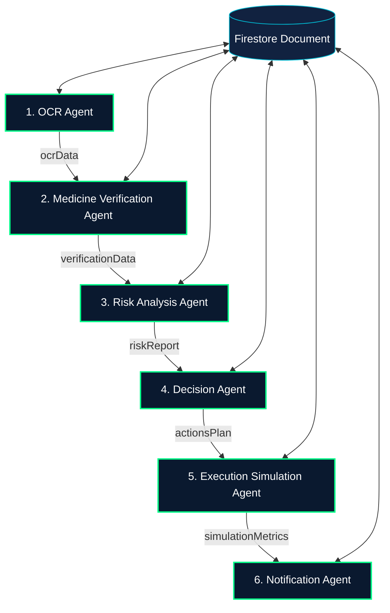
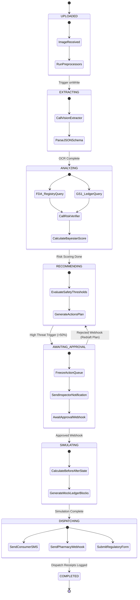

# PharmaGuard AI — Multi-Agent Workflow Specification

This document details the highly autonomous multi-agent system orchestrating the **PharmaGuard AI** platform. It describes the design patterns, isolated agent responsibilities, failure mitigation procedures, planning logics, and communications frameworks that satisfy the requirements of a premium agentic AI solution.

---

## 1. Deep-Dive Agent Profiles



---

### Agent 1: OCR Agent (`OCR_Agent`)

#### Purpose
Intake raw medicine packaging images, execute localized computer vision operations, perform layout analysis, extract unstructured textual fields, and parse key variables (brand name, generic name, active ingredients, dosage, manufacturer, expiration/manufacturing dates, NDC, serial/batch numbers, barcodes). Additionally, flags initial visual graphic package anomalies.

#### Inputs
*   `imageStream`: Base64 encoded JPEG/PNG or high-resolution Firebase Cloud Storage URI.
*   `geoCoordinates`: Coordinates where the scan was captured.

#### Outputs
```json
{
  "rawText": "String",
  "ocrData": {
    "brandName": "String",
    "genericName": "String",
    "manufacturer": "String",
    "dosage": "String",
    "batchNumber": "String",
    "serialNumber": "String",
    "mfgDate": "String",
    "expiryDate": "String",
    "ndc": "String",
    "detectedBarcodes": ["String"]
  },
  "graphicAudit": {
    "logoAlignmentOffsetMm": "Number",
    "colorPaletteMatchConfidence": "Number",
    "fontStructureWarning": "Boolean"
  }
}
```

#### Reasoning Process
1.  **Image Prep**: Apply sharpening, deskewing, and local binarization thresholds to optimize target package surface texts.
2.  **Multimodal Ingestion**: Feed pre-processed image into multimodal text structures, directing model focus to regulatory details.
3.  **Entity Resolution**: Apply Regular Expression token matchings and semantic distance logic to classify recognized text strings to key variables (e.g. mapping `/^\d{4}-\d{4}-\d{2}$/` formats to NDC numbers).
4.  **Graphic Audit**: Compare packaging design geometry (displacement of manufacturer logo from outer margin and font structure match metrics) against brand template vectors.

#### Tools/APIs Used
*   *Google Cloud Vision API* (Text coordinates detection).
*   *Gemini 1.5 Flash* (Structured multimodal layout analysis).
*   *Sharp (Node.js)* (Image rotation, binarization, and sharpening).

#### Failure Handling
*   **Low Contrast/Blurry Images (`ERR_OCR_LOW_CONFIDENCE`)**: Run visual contrast optimization pipeline. If text reading confidence is `< 65%`, abort processing, write failure details to database, and alert client device with prompt for camera recalibration.
*   **Truncated Strings**: If fields (like expiration dates) are partially cut off, run context-driven semantic interpolation over the surrounding text strings to approximate the values.

#### Interaction with Other Agents
Initializes the system state. Saves parsed information to Firestore `scans/{scanId}` and pushes an execution payload token to the orchestration queue to launch the `Medicine_Verification_Agent`.

---

### Agent 2: Medicine Verification Agent (`Medicine_Verification_Agent`)

#### Purpose
Verify that the package details parsed by the `OCR_Agent` correspond to valid, approved, non-expired pharmaceuticals, and trace their legal chain of custody.

#### Inputs
*   `ocrData` JSON schema from `OCR_Agent`.
*   `geoCoordinates` of the scanner.

#### Outputs
```json
{
  "ndcRegistryMatch": "Boolean",
  "fdaApprovedRegistryRecord": {
    "officialBrandName": "String",
    "officialActiveIngredients": "String",
    "registrationStatus": "String"
  },
  "supplyChainAudit": {
    "serialExistsInLedger": "Boolean",
    "batchValid": "Boolean",
    "originPlant": "String",
    "intendedDestination": "String",
    "geoRouteAnomaly": "Boolean"
  }
}
```

#### Reasoning Process
1.  **Registry Querying**: Perform parallel requests to the FDA NDC database and RxNav directories to verify that the scanned NDC code exists and matches the parsed drug name and dosage.
2.  **Serialization Check**: Call manufacturer electronic ledgers to confirm if the unique serial number exists under the specified batch number.
3.  **Chronological Check**: Verify that current system dates do not exceed the printed expiration dates.
4.  **Route Verification**: Compare coordinates of the scanning device with the intended shipment registry path logged in the supply chain ledger. Flag mismatch anomalies if a package destined for "California, USA" is scanned in "Cape Town, South Africa".

#### Tools/APIs Used
*   *FDA Open API & RxNav API* (Drug catalog matches).
*   *GS1 EPCIS Supply Chain REST Webhook* (Batch serialization tracking).

#### Failure Handling
*   **External Database Timeout (`REGISTRY_OFFLINE_WARNING`)**: Fallback to local offline mirror containing index entries of the top 5,000 common pharmaceuticals. Append warning flags notifying subsequent agents that live network verification was bypassed.
*   **Serial Coding Omitted**: For over-the-counter medicine missing standard serial formats, mark serial audit state as `NOT_APPLICABLE` rather than flagging it as a violation.

#### Interaction with Other Agents
Reads `ocrData`. Writes registry check matrices to database. Passes complete verification outputs to the `Risk_Analysis_Agent`.

---

### Agent 3: Risk Analysis Agent (`Risk_Analysis_Agent`)

#### Purpose
Formulate a mathematical risk profile regarding the scanned medicine's authenticity, combining structural visual anomalies with supply chain ledger discrepancies.

#### Inputs
*   `ocrData` (Agent 1 outputs).
*   `verificationData` (Agent 2 outputs).

#### Outputs
```json
{
  "riskScore": "Number (0 to 100)",
  "riskCategory": "String (safe | low_risk | moderate_risk | high_risk | critical_danger)",
  "confidenceScore": "Number (percentage)",
  "discrepancyReports": [
    {
      "indicator": "String",
      "severity": "String (low | medium | high)",
      "impactWeight": "Number"
    }
  ]
}
```

#### Reasoning Process
1.  **Discrepancy Matrix Compilation**: Run a weighted scoring pipeline over verified mismatches:
    *   Brand spelling error (e.g. "Adviil" instead of "Advil") $\rightarrow$ Weight: $1.00$ (Critical Danger)
    *   Serial absent from manufacturer GS1 registry $\rightarrow$ Weight: $0.90$ (High Risk)
    *   Batch expiration date mismatch $\rightarrow$ Weight: $0.75$ (High Risk)
    *   Logo layout displacement $> 4mm$ $\rightarrow$ Weight: $0.40$ (Moderate Anomaly)
2.  **Bayesian Classification**: Apply dynamic risk classification based on match vectors.
3.  **Confidence Assessment**: Calculate data availability completeness (e.g., if FDA records are down, confidence is reduced by 20%).

#### Tools/APIs Used
*   *Gemini 1.5 Pro* (For context-aware discrepancy resolution and security classification).
*   *Fuzzy Matching Libraries (Levenshtein Distance)*.

#### Failure Handling
*   **Highly Ambiguous Data (`ERR_RISK_AMBIGUITY`)**: If confidence drops below 50% due to missing registry answers, flag risk state as `AWAITING_HUMAN_TRIAGE`, lock status, and write diagnostic logs for inspector attention.

#### Interaction with Other Agents
Reads verification states. Outputs risk metrics to `scans/{scanId}/riskAnalysis`. Signals `Decision_Agent` to evaluate threat thresholds.

---

### Agent 4: Decision Agent (`Decision_Agent`)

#### Purpose
Act as the central brain of the ecosystem, formulating containment policies, response schedules, and drafting medical safety advisories tailored to the threat severity.

#### Inputs
*   `riskAnalysis` JSON payload.
*   `clinicalSafetyContext` (Clinical database references on counterfeit toxins).

#### Outputs
```json
{
  "verdict": "String (AUTHORIZE | SUSPEND | QUARANTINE | EXPOSE)",
  "requiresHumanApproval": "Boolean",
  "proposedActions": [
    {
      "actionId": "String",
      "type": "String",
      "targetRecipient": "String",
      "endpoint": "String",
      "priority": "String",
      "draftPayload": "String"
    }
  ]
}
```

#### Reasoning Process
1.  **Verdict Selection**: Evaluate the calculated Risk Score:
    *   *Score < 15*: `AUTHORIZE` (Safe product).
    *   *Score 15–50*: `SUSPEND` (Low-to-moderate risks, request secondary visual review).
    *   *Score > 50*: `QUARANTINE` or `EXPOSE` (High authenticity danger, block distribution).
2.  **Action Strategy Drafting**: If critical risks are detected, build a multi-channel response matrix:
    *   *Channel A (Consumer)*: Immediate warning notification.
    *   *Channel B (Pharmacy)*: Quarantine mandate drafting.
    *   *Channel C (Regulatory)*: Formulate official FDA Adverse Event Reporting System (FAERS) report summary.
3.  **Context-Aware Content Synthesis**: Draft specific medical advisories based on known packaging contaminants (e.g. writing warnings regarding potential diethylene glycol fillers if active solvents are absent from test records).

#### Tools/APIs Used
*   *Gemini 1.5 Pro* (For high-compliance text formulation and regulatory reporting formats).

#### Failure Handling
*   **Safety Action Draft Failures**: If text generation fails or outputs invalid formats, abort custom text generation and fallback to strict predefined system templates (e.g., standard patient safety quarantine warning text).

#### Interaction with Other Agents
Analyzes risk score. Formulates action plans. If actions involve regulatory alerts or legal audits, passes the draft actions schema to the `Execution_Simulation_Agent` and triggers Human-in-the-Loop locks if required.

---

### Agent 5: Execution Simulation Agent (`Execution_Simulation_Agent`)

#### Purpose
Simulate the systemic real-world impact of executing the drafted safety actions, projecting metrics changes across the healthcare chain, and validating ledger transaction changes.

#### Inputs
*   `proposedActions` payload from `Decision_Agent`.
*   `environmentState` (Current local infection metrics, pharmacy trust levels, patient exposure rates).

#### Outputs
```json
{
  "simulationTimeline": [
    {
      "timestamp": "String",
      "event": "String",
      "status": "String"
    }
  ],
  "stateChange": {
    "before": {
      "exposureRisk": "Number",
      "distributorLiability": "Number",
      "publicPanicIndex": "Number"
    },
    "after": {
      "exposureRisk": "Number",
      "distributorLiability": "Number",
      "publicPanicIndex": "Number"
    }
  },
  "blockchainTransactionPreview": {
    "invalidationLedgerHash": "String",
    "serialFlagApplied": "String"
  }
}
```

#### Reasoning Process
1.  **Baseline Extraction**: Ingest local environmental index metrics.
2.  **Dynamic Simulation**: Run predictive model projections:
    *   *Impact of Patient SMS*: Reduces regional exposure index by $35\%$ over 48 hours.
    *   *Impact of Pharmacy Webhook*: Triggers local storage quarantine, reducing distributor legal liability metrics from *Critical* to *Shielded*.
    *   *Impact of GS1 Invalidation*: Flags barcode globally, stopping secondary transaction attempts across connected supply chains.
3.  **Hash Verification**: Simulate the GS1 distributed ledger transaction by generating cryptographic state block previews.

#### Tools/APIs Used
*   *Custom mathematical projection scripts*.
*   *Gemini 1.5 Flash* (Determining complex state change correlations).

#### Failure Handling
*   **Projection Bounds Mismatch**: If mathematical models yield scores outside absolute indices (e.g., negative risk exposure), normalize parameters to boundary thresholds (0% or 100%) and write diagnostic warnings to execution records.

#### Interaction with Other Agents
Consumes proposed action plans. Computes simulated network changes. Saves metrics history to scans, prompting `Notification_Agent` to release real alerts upon verification.

---

### Agent 6: Notification Agent (`Notification_Agent`)

#### Purpose
Directly dispatch finalized, verified alerts, notices, and legal submissions to external systems (consumers, regulatory departments, manufacturers).

#### Inputs
*   Simulated and approved action payloads (`proposedActions` + `simulation` state confirmation).

#### Outputs
```json
{
  "dispatchReceipts": [
    {
      "actionId": "String",
      "channel": "String",
      "recipient": "String",
      "deliveryStatus": "String",
      "trackingId": "String"
    }
  ]
}
```

#### Reasoning Process
1.  **Channel Route Allocation**: Map each target action to its physical connection channel (SMS, email SMTP, REST Webhook).
2.  **Data Serialization**: Format transmission payloads to expected third-party REST requirements.
3.  **Delivery Verification**: Dispatch payloads and track response headers. Write transaction receipts to database log files.

#### Tools/APIs Used
*   *Twilio REST SMS API*.
*   *SendGrid Email SMTP Gateway*.
*   *Node-Fetch / Axios API Webhook Connectors*.

#### Failure Handling
*   **Carrier Outage (`ERR_CARRIER_TIMEOUT`)**: Automatically log carrier connection errors, queue delivery tokens, and attempt retry loops using exponential backoff schedules. If failures persist over 3 retries, escalate warning alerts to system diagnostics.

#### Interaction with Other Agents
Receives final instructions from the orchestrator. Excutes final delivery transactions. Upon successful dispatches, updates the parent Scan document status to `completed` and logs timeline events.

---

## 2. Advanced Multi-Agent Planning & Orchestration Logic



### 1. Planning Logic & Task Orchestration
The orchestration engine uses **State Machine Routing** alongside **Context Compaction**. Rather than running generic linear pipelines, the orchestrator acts as a dynamic state machine router:

*   **Dynamic Context Packets**: Each agent produces isolated outputs. Passing all raw visual data down the chain quickly exhausts context windows. The orchestrator extracts and compresses details at each step (e.g. condensing 20,000 raw OCR tokens down to a 300-token JSON schema) before starting subsequent agents.
*   **Branching Tasks**: The pipeline branches based on intermediate outputs. If `Medicine_Verification_Agent` registers an NDC mismatch, the orchestrator bypasses low-priority supply chain route evaluations and directly launches high-priority risk and toxicology planning tracks.

### 2. Decision Tree Specification
Decisions branch dynamically at the output of the **Risk Analysis Agent** as detailed below:

```text
                                   [ RISK SCORE ]
                                         │
                 ┌───────────────────────┼───────────────────────┐
                 ▼                       ▼                       ▼
            [ Risk < 15% ]         [ 15% <= Risk <= 50% ]    [ Risk > 50% ]
                 │                       │                       │
                 ▼                       ▼                       ▼
         [ SAFE CATEGORY ]       [ WARNING CATEGORY ]    [ HAZARD CATEGORY ]
                 │                       │                       │
      (Action: AUTHORIZE USE)     (Action: SUSPEND VERDICT) (Action: QUARANTINE / ALERT)
                 │                       │                       │
                 ▼                       ▼                       ▼
           Close Scan            Trigger Visual Recheck   Is User an Inspector?
        (Mark: COMPLETED)      (Notify: QA Desk Queue)           │
                                                                 ├─── Yes ──► Direct Simulation
                                                                 │            & Execution
                                                                 │
                                                                 └─── No ───► AWAITING APPROVAL
                                                                              (Freeze Queue & 
                                                                               Await Webhook)
```

---

## 3. Communication & Execution Schema

Agents do not query each other directly; they operate through a **Decoupled Blackboard Pattern** using Firestore document transactions. This ensures transaction auditability and fault isolation.

```text
                     ┌──────────────────────────────────────────────┐
                     │          FIRESTORE SCAN DOCUMENT             │
                     │          (Shared State Blackboard)           │
                     └──────────────────────┬───────────────────────┘
                                            │
         ┌───────────────┬──────────────────┼───────────────┬──────────────────┐
         ▼               ▼                  ▼               ▼                  ▼
    ┌──────────┐   ┌───────────┐      ┌───────────┐   ┌──────────┐       ┌────────────┐
    │   OCR    │   │ Registry  │      │   Risk    │   │ Decision │       │ Simulation │
    │  Agent   │   │  Agent    │      │  Agent    │   │  Agent   │       │   Agent    │
    └────┬─────┘   └─────┬─────┘      └─────┬─────┘   └────┬─────┘       └─────┬──────┘
         │               │                  │              │                   │
         └───────────────┴──────────────────┼───────────────┴──────────────────┘
                                            ▼
                     ┌──────────────────────────────────────────────┐
                     │       ANTIGRAVITY ORCHESTRATION ENGINE       │
                     │            (State-Event Manager)             │
                     └──────────────────────┬───────────────────────┘
                                            │
                                            ▼
                                  [ Notification Agent ]
                                            │
                                            ▼
                                  (External Connectors)
```

---

## 4. Trace Logging JSON Format

Every execution step generates deep tracing arrays. This JSON structure enables real-time progress timelines on mobile apps and provides a clear audit log for regulatory compliance.

```json
{
  "scanId": "scan_837492_US",
  "orchestratorVersion": "Antigravity-1.2.0-Prod",
  "startTimestamp": "2026-05-18T15:29:19.000Z",
  "globalStatus": "completed",
  "executionTrace": [
    {
      "step": 1,
      "agentName": "OCR_Agent",
      "timestamp": "2026-05-18T15:29:19.230Z",
      "status": "success",
      "executionTimeMs": 850,
      "inputRef": "gs://pharmaguard-uploads/scans/scan_837492.jpg",
      "reasoningTrace": "Ingested base64 raw package image. Sharp library optimized local contrast parameters. Identified visual block coordinates at bounding box [12, 45, 230, 80]. Regex verified signature matching NDC pattern. Logo offset computed at 1.2mm (within safety bounds).",
      "outputData": {
        "brandName": "Singulair",
        "ndc": "0006-0711-54",
        "batchNumber": "B-998822",
        "serialNumber": "PG-837492-US"
      }
    },
    {
      "step": 2,
      "agentName": "Medicine_Verification_Agent",
      "timestamp": "2026-05-18T15:29:20.100Z",
      "status": "success",
      "executionTimeMs": 1240,
      "inputRef": "scans/scan_837492/ocrData",
      "reasoningTrace": "Queried mock FDA registry endpoint using parsed NDC '0006-0711-54'. Registry returned drug approved status matching brand Singulair. Executed verification check on manufacturer GS1 ledger for serial PG-837492-US under batch B-998822. GS1 ledger flagged exception status: Serial exists but was registered in batch B-442200, indicating a batch replication packaging fraud.",
      "outputData": {
        "fdaApproved": true,
        "gs1SerialExists": true,
        "batchMismatchAnomaly": true
      }
    },
    {
      "step": 3,
      "agentName": "Risk_Analysis_Agent",
      "timestamp": "2026-05-18T15:29:21.400Z",
      "status": "success",
      "executionTimeMs": 620,
      "inputRef": "scans/scan_837492/verificationData",
      "reasoningTrace": "Compiled discrepancy matrix. High weight applied to GS1 batch mismatch anomaly (weight: 0.90). Low weight applied to logo offset (weight: 0.10). Calculated integrated Bayesian authenticity risk. Integrated risk evaluated at 82%. Classified category as critical_danger.",
      "outputData": {
        "riskScore": 82,
        "riskCategory": "critical_danger",
        "confidenceRating": 95
      }
    },
    {
      "step": 4,
      "agentName": "Decision_Agent",
      "timestamp": "2026-05-18T15:29:22.100Z",
      "status": "success",
      "executionTimeMs": 1400,
      "inputRef": "scans/scan_837492/riskAnalysis",
      "reasoningTrace": "Risk index evaluated at 82%, exceeding hazard threshold (>50%). Formulated containing strategies. Patient is identified as standard consumer, triggering Human-in-the-Loop review protocols. Queued action execution loops. Synthesized patient advisory warnings warning against batch B-998822. Drafted official FDA MedWatch ADR reporting forms.",
      "outputData": {
        "verdict": "QUARANTINE",
        "requiresHumanApproval": true,
        "proposedActions": [
          {
            "actionId": "act_9832",
            "type": "patient_sms_alert",
            "recipient": "+15550198273",
            "payload": "ALERT: Singulair packaging B-998822 has failed validation. Do not consume."
          },
          {
            "actionId": "act_9833",
            "type": "fda_adr_submission",
            "recipient": "fda-adr-staging@fda.gov",
            "payload": "Official FAERS Incident Report: Singulair batch replication detected at scan GPS coordinates..."
          }
        ]
      }
    },
    {
      "step": 5,
      "agentName": "Execution_Simulation_Agent",
      "timestamp": "2026-05-18T15:29:23.600Z",
      "status": "success",
      "executionTimeMs": 950,
      "inputRef": "scans/scan_837492/actionsPlan",
      "reasoningTrace": "Simulated dispatcher execution. Modeled direct impacts over local epidemiology nodes. Exposure risk drop index projected at -88% based on user quarantine compliance. Legal exposure liability status transitions from HIGH to PROTECTED. Computed simulated GS1 invalidation ledger update block.",
      "outputData": {
        "exposureRiskDelta": -88,
        "distributorLiabilityBefore": 90,
        "distributorLiabilityAfter": 12,
        "simulatedBlockAddress": "0x8fae8372d8aee37d2f838290"
      }
    },
    {
      "step": 6,
      "agentName": "Notification_Agent",
      "timestamp": "2026-05-18T15:29:24.600Z",
      "status": "success",
      "executionTimeMs": 1100,
      "inputRef": "scans/scan_837492/simulation",
      "reasoningTrace": "Inspector approved validation webhook. Released queue holding alert dispatches. Connected to Twilio gateway and pushed SMS to consumer. Pushed FDA reporting data SMTP blocks via SendGrid. Registered success receipts.",
      "outputData": {
        "smsSent": true,
        "emailSent": true,
        "deliveryTraceId": "tr_89327498"
      }
    }
  ],
  "endTimestamp": "2026-05-18T15:29:25.700Z",
  "totalDurationMs": 6700
}
```

---
*PharmaGuard AI Agentic Orchestration Specifications — Verified Core Architectural Documentation — May 2026.*
