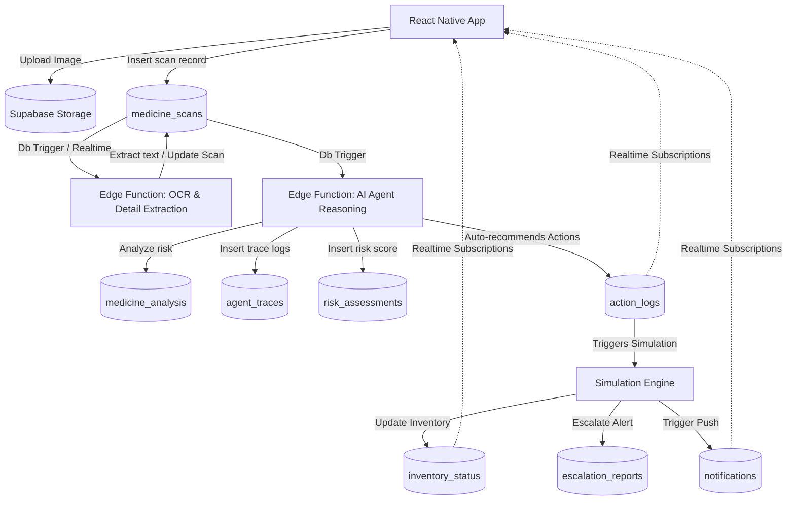

# PharmaGuard AI — Supabase Backend Architecture & Database Design

This document details the complete Supabase backend architecture designed for **PharmaGuard AI — Autonomous Counterfeit Medicine Intelligence & Response System**. It is optimized for hackathon speed, realtime dashboarding, traceability, and action simulation.

---

## 1. Complete Supabase Architecture

The PharmaGuard AI architecture leverages Supabase's serverless Postgres database, Realtime engine, storage, and edge functions to construct an event-driven AI workflow.



---

## 2. PostgreSQL Database Schema

```sql
-- Enable UUID extension
create extension if not exists "uuid-ossp";

-- Define Enums
create type risk_level_enum as enum ('LOW', 'MEDIUM', 'HIGH', 'CRITICAL');
create type action_status_enum as enum ('PENDING', 'SIMULATING', 'EXECUTED', 'FAILED');
create type action_type_enum as enum ('INVENTORY_BLOCK', 'PHARMACIST_ALERT', 'AUTHORITY_ESCALATION', 'PUBLIC_WARNING');
create type trace_step_enum as enum ('OCR', 'CLASSIFICATION', 'VERIFICATION', 'THREAT_MODELING', 'DECISION');

-- 1. Profiles Table (Extends Supabase Auth)
create table public.profiles (
    id uuid references auth.users on delete cascade primary key,
    email text not null,
    full_name text,
    role text default 'user' check (role in ('user', 'pharmacist', 'inspector', 'admin')),
    created_at timestamp with time zone default timezone('utc'::text, now()) not null,
    updated_at timestamp with time zone default timezone('utc'::text, now()) not null
);

-- 2. Medicine Scans Table
create table public.medicine_scans (
    id uuid default uuid_generate_v4() primary key,
    user_id uuid references public.profiles(id) on delete set null,
    image_url text not null,
    raw_ocr_text text,
    scanned_at timestamp with time zone default timezone('utc'::text, now()) not null,
    gps_latitude numeric,
    gps_longitude numeric,
    device_info jsonb
);

-- 3. Medicine Analysis Table
create table public.medicine_analysis (
    id uuid default uuid_generate_v4() primary key,
    scan_id uuid references public.medicine_scans(id) on delete cascade not null,
    extracted_name text,
    extracted_manufacturer text,
    extracted_batch_number text,
    extracted_expiry_date date,
    is_packaging_valid boolean default true,
    is_expiry_valid boolean default true,
    mismatch_details text[],
    analyzed_at timestamp with time zone default timezone('utc'::text, now()) not null
);

-- 4. Risk Assessments Table
create table public.risk_assessments (
    id uuid default uuid_generate_v4() primary key,
    scan_id uuid references public.medicine_scans(id) on delete cascade not null,
    overall_score numeric(5,2) check (overall_score >= 0.00 and overall_score <= 100.00) not null,
    risk_level risk_level_enum not null,
    confidence_score numeric(5,2) check (confidence_score >= 0.00 and confidence_score <= 100.00) not null,
    threat_matrix jsonb not null, -- {"packaging": 85, "expiry": 20, "manufacturer": 90}
    reasoning_summary text not null,
    assessed_at timestamp with time zone default timezone('utc'::text, now()) not null
);

-- 5. Action Logs (For Simulations)
create table public.action_logs (
    id uuid default uuid_generate_v4() primary key,
    scan_id uuid references public.medicine_scans(id) on delete cascade not null,
    action_type action_type_enum not null,
    status action_status_enum default 'PENDING' not null,
    parameters jsonb default '{}'::jsonb not null, -- target batch, pharmacy id, etc.
    before_state jsonb, -- State Snapshot before simulation execution
    after_state jsonb,  -- State Snapshot after simulation execution
    execution_duration_ms integer,
    executed_at timestamp with time zone,
    failure_reason text
);

-- 6. Inventory Status (For Blocking simulation)
create table public.inventory_status (
    id uuid default uuid_generate_v4() primary key,
    pharmacy_name text not null,
    medicine_name text not null,
    batch_number text not null,
    stock_quantity integer not null,
    status text default 'ACTIVE' check (status in ('ACTIVE', 'BLOCKED', 'QUARANTINED', 'RECALLED')),
    last_updated timestamp with time zone default timezone('utc'::text, now()) not null
);

-- 7. Notifications
create table public.notifications (
    id uuid default uuid_generate_v4() primary key,
    recipient_role text not null check (recipient_role in ('user', 'pharmacist', 'inspector', 'admin')),
    title text not null,
    message text not null,
    read boolean default false not null,
    metadata jsonb default '{}'::jsonb, -- dynamic actions payload
    created_at timestamp with time zone default timezone('utc'::text, now()) not null
);

-- 8. Agent Traces (Reasoning Logs)
create table public.agent_traces (
    id uuid default uuid_generate_v4() primary key,
    scan_id uuid references public.medicine_scans(id) on delete cascade not null,
    step trace_step_enum not null,
    agent_name text not null,
    input_payload jsonb,
    thought_process text not null,
    output_payload jsonb,
    elapsed_time_ms integer,
    created_at timestamp with time zone default timezone('utc'::text, now()) not null
);

-- 9. Escalation Reports (Authority Escalation)
create table public.escalation_reports (
    id uuid default uuid_generate_v4() primary key,
    scan_id uuid references public.medicine_scans(id) on delete cascade not null,
    authority_name text not null, -- e.g., "FDA", "National Health Authority"
    escalation_priority text default 'MEDIUM' check (escalation_priority in ('LOW', 'MEDIUM', 'HIGH', 'IMMEDIATE')),
    evidence_payload jsonb not null, -- Packaged metadata and image URLs
    status text default 'SUBMITTED' check (status in ('SUBMITTED', 'UNDER_INVESTIGATION', 'RESOLVED')),
    escalated_at timestamp with time zone default timezone('utc'::text, now()) not null
);
```

---

## 3. Table Relationships

```
profiles.id (1) <----> (0..*) medicine_scans.user_id
medicine_scans.id (1) <----> (1) medicine_analysis.scan_id
medicine_scans.id (1) <----> (1) risk_assessments.scan_id
medicine_scans.id (1) <----> (0..*) action_logs.scan_id
medicine_scans.id (1) <----> (0..*) agent_traces.scan_id
medicine_scans.id (1) <----> (0..*) escalation_reports.scan_id
```

---

## 4. Example Data Rows

### `medicine_scans`
```json
{
  "id": "e30fbd9c-705a-4933-a1bf-5efc8a5a41a4",
  "user_id": "8c59f27d-9442-45e0-826c-31a986cb0071",
  "image_url": "https://[project-id].supabase.co/storage/v1/object/public/scans/user_8c59f2/scan_171612.jpg",
  "raw_ocr_text": "Amoxicillin 500mg \nBatch: AMX-2024-099\nExp: 12/2026\nManufactured by: Apotex Inc.",
  "gps_latitude": 37.7749,
  "gps_longitude": -122.4194,
  "device_info": {"model": "iPhone 15", "os": "iOS 17.4"}
}
```

### `risk_assessments`
```json
{
  "id": "2b9fd0c1-23c0-432d-945e-d2b404d0ef9b",
  "scan_id": "e30fbd9c-705a-4933-a1bf-5efc8a5a41a4",
  "overall_score": 82.50,
  "risk_level": "HIGH",
  "confidence_score": 94.00,
  "threat_matrix": {
    "packaging_anomaly": 90,
    "expiry_mismatch": 10,
    "manufacturer_auth": 85
  },
  "reasoning_summary": "Logo typeface on blister pack matches known counterfeit patterns for Batch AMX-2024-099. Manufacturer records show batch AMX-2024-099 expired in 2022, but blister pack lists 12/2026."
}
```

---

## 5. Supabase Authentication Structure

We implement an automatic trigger to sync Supabase Auth users to the custom `public.profiles` table.

```sql
-- Trigger Function to sync metadata to Profiles table
create or replace function public.handle_new_user()
returns trigger as $$
begin
  insert into public.profiles (id, email, full_name, role)
  values (
    new.id,
    new.email,
    coalesce(new.raw_user_meta_data->>'full_name', 'Anonymous Agent'),
    coalesce(new.raw_user_meta_data->>'role', 'user')
  );
  return new;
end;
$$ language plpgsql security definer;

-- Bind Trigger to Auth.users
create trigger on_auth_user_created
  after insert on auth.users
  for each row execute procedure public.handle_new_user();
```

---

## 6. Row-Level Security (RLS) Strategy

For a hackathon, we keep policies direct but secure. Admins, Inspectors, and Pharmacists gain broader write/read access, while regular Users read/write their own scans.

```sql
-- Enable RLS
alter table public.profiles enable row level security;
alter table public.medicine_scans enable row level security;
alter table public.medicine_analysis enable row level security;
alter table public.risk_assessments enable row level security;
alter table public.action_logs enable row level security;
alter table public.inventory_status enable row level security;
alter table public.notifications enable row level security;
alter table public.agent_traces enable row level security;
alter table public.escalation_reports enable row level security;

-- Profiles Policies
create policy "Allow public read of profiles" on public.profiles for select using (true);
create policy "Users can update own profile" on public.profiles for update using (auth.uid() = id);

-- Medicine Scans Policies
create policy "Users can insert their own scans" on public.medicine_scans for insert with check (auth.uid() = user_id);
create policy "Users can view their own scans" on public.medicine_scans for select using (auth.uid() = user_id or exists (
  select 1 from public.profiles where id = auth.uid() and role in ('inspector', 'admin')
));

-- Action Logs / Assessments Read Policies (Internal Dashboard access)
create policy "Allow authenticated reads on Risk Assessments" on public.risk_assessments for select using (auth.role() = 'authenticated');
create policy "Allow authenticated reads on Action Logs" on public.action_logs for select using (auth.role() = 'authenticated');
```

---

## 7. Realtime Subscriptions Plan

Realtime updates drive the before vs after transition visualization.

1. **Dashboard Subscription**: Subscribes to `action_logs` and `inventory_status` tables to listen to simulated states changes dynamically.
2. **Notification Feeds**: Subscribes to the `notifications` table, filtered by recipient role.
3. **Agent Trace Updates**: Realtime subscription to `agent_traces` allows developers and pitch judges to see the "Agent thinking step-by-step..." text populate live on screen.

### JavaScript Subscription Example:
```typescript
const agentTraceSubscription = supabase
  .channel('live-traces')
  .on('postgres_changes', { event: 'INSERT', schema: 'public', table: 'agent_traces' }, payload => {
    console.log('Agent step executing:', payload.new);
  })
  .subscribe();
```

---

## 8. Storage Bucket Structure

We configure a public/private hybrid bucket called `pharmaguard-assets`.

```
pharmaguard-assets/
├── scans/
│   └── [user_uuid]/
│       └── scan_[timestamp]_[random].jpg  (Scan uploads, read protected by owner)
└── reports/
    └── escalation_[scan_uuid].pdf          (Authority Escalation documentation bundle)
```

**Storage Security Policy:**
```sql
create policy "Allow scanned image uploads" on storage.objects for insert with check (
  bucket_id = 'pharmaguard-assets' AND (auth.uid()::text = (storage.foldername(name))[2])
);
```

---

## 9. Edge Functions Architecture

We run lightweight TypeScript Edge Functions to run OCR parsing, connect with Gemini API agents, and perform action logging.

### `supabase/functions/orchestrate-agent/index.ts`
```typescript
import { serve } from "https://deno.land/std@0.168.0/http/server.ts"
import { createClient } from 'https://esm.sh/@supabase/supabase-js@2'

serve(async (req) => {
  const { scanId, imageUrl } = await req.json()

  // Initialize Supabase Client
  const supabase = createClient(
    Deno.env.get('SUPABASE_URL') ?? '',
    Deno.env.get('SUPABASE_SERVICE_ROLE_KEY') ?? ''
  )

  // Step 1: Simulated OCR Extraction
  await supabase.from('agent_traces').insert({
    scan_id: scanId,
    step: 'OCR',
    agent_name: 'OCR Parser Agent',
    thought_process: 'Parsing label text for batch numbers, manufacturers and shelf dates.'
  });
  
  // (Perform Gemini API call to parse text & detect mismatch)
  // Step 2: Risk Assessment
  const overallScore = 85.0; // Simulated response
  await supabase.from('risk_assessments').insert({
    scan_id: scanId,
    overall_score: overallScore,
    risk_level: 'HIGH',
    confidence_score: 91.2,
    threat_matrix: { packaging: 90, manufacturer: 80 },
    reasoning_summary: 'Batch mismatches with active inventory listings.'
  });

  // Step 3: Action Execution Recommendations
  await supabase.from('action_logs').insert({
    scan_id: scanId,
    action_type: 'INVENTORY_BLOCK',
    status: 'PENDING',
    parameters: { batch_number: 'AMX-2024-099', pharmacy_name: 'Metro Pharmacy' }
  });

  return new Response(JSON.stringify({ success: true }), { headers: { "Content-Type": "application/json" } })
})
```

---

## 10. API Integration Layer (Client Code)

This code manages upload, insertion, orchestration trigger, and state polling.

```typescript
import { createClient } from '@supabase/supabase-js';

const supabaseUrl = process.env.EXPO_PUBLIC_SUPABASE_URL || '';
const supabaseAnonKey = process.env.EXPO_PUBLIC_SUPABASE_ANON_KEY || '';

export const supabase = createClient(supabaseUrl, supabaseAnonKey);

export async function uploadScanAndRunAnalysis(imageUri: string, userId: string, location: { lat: number; lng: number }) {
  // 1. Convert Image to ArrayBuffer and Upload
  const response = await fetch(imageUri);
  const blob = await response.blob();
  const fileExtension = imageUri.split('.').pop() || 'jpg';
  const filePath = `scans/${userId}/scan_${Date.now()}.${fileExtension}`;

  const { data: uploadData, error: uploadError } = await supabase.storage
    .from('pharmaguard-assets')
    .upload(filePath, blob, { contentType: 'image/jpeg' });

  if (uploadError) throw uploadError;

  const publicUrl = supabase.storage.from('pharmaguard-assets').getPublicUrl(filePath).data.publicUrl;

  // 2. Insert into medicine_scans
  const { data: scanData, error: scanError } = await supabase
    .from('medicine_scans')
    .insert({
      user_id: userId,
      image_url: publicUrl,
      gps_latitude: location.lat,
      gps_longitude: location.lng
    })
    .select()
    .single();

  if (scanError) throw scanError;

  // 3. Trigger Edge Function orchestration
  const { data: edgeData, error: edgeError } = await supabase.functions.invoke('orchestrate-agent', {
    body: { scanId: scanData.id, imageUrl: publicUrl }
  });

  if (edgeError) throw edgeError;

  return scanData.id;
}
```

---

## 11. Logging Strategy

System audit logs and reasoning outputs are stored in `agent_traces`. This fulfills the requirement of absolute traceability. Every LLM iteration, system decision, or agent validation path gets written with structured JSON payloads containing inputs, decisions, outputs, and performance timers.

---

## 12. Before vs After State Tracking

To show dashboard state changes (e.g., locking a compromised medicine batch), the simulation updates `action_logs` and captures states.

- **`before_state` JSON**:
  ```json
  {"batch_number": "AMX-2024-099", "status": "ACTIVE", "stock_quantity": 450}
  ```
- **`after_state` JSON**:
  ```json
  {"batch_number": "AMX-2024-099", "status": "BLOCKED", "stock_quantity": 450}
  ```

---

## 13. Action Simulation Database Flow

When an `action_logs` row is created, a Postgres trigger or an Edge function listens to execute the simulation:

```sql
-- Trigger to run action execution simulation
create or replace function public.simulate_action_execution()
returns trigger as $$
declare
  current_inventory_status text;
  batch_id text;
begin
  if new.status = 'PENDING' then
    -- Update status to simulating
    update public.action_logs set status = 'SIMULATING' where id = new.id;
    
    -- Extract batch configuration parameter
    batch_id := new.parameters->>'batch_number';
    
    -- Capture Before State
    select status into current_inventory_status 
    from public.inventory_status 
    where batch_number = batch_id limit 1;
    
    update public.action_logs 
    set before_state = jsonb_build_object('batch_number', batch_id, 'status', coalesce(current_inventory_status, 'UNKNOWN')) 
    where id = new.id;
    
    -- Simulate Execution Delay & State mutation
    if new.action_type = 'INVENTORY_BLOCK' then
       update public.inventory_status set status = 'BLOCKED' where batch_number = batch_id;
    end if;
    
    -- Capture After State & Set Executed status
    update public.action_logs 
    set status = 'EXECUTED', 
        after_state = jsonb_build_object('batch_number', batch_id, 'status', 'BLOCKED'), 
        executed_at = now() 
    where id = new.id;
  end if;
  return new;
end;
$$ language plpgsql security definer;

create trigger tr_simulate_action_execution
  after insert on public.action_logs
  for each row execute procedure public.simulate_action_execution();
```

---

## 14. Recommended Indexes and Optimization

For real-time querying performance on dashboard loads:

```sql
-- Fast index lookup for scans per user
create index idx_scans_user_id on public.medicine_scans (user_id);

-- Speed up analysis joins by scan_id
create index idx_analysis_scan_id on public.medicine_analysis (scan_id);

-- Index for searching specific inventory batches
create index idx_inventory_batch on public.inventory_status (batch_number);

-- Real-time order sorting optimize
create index idx_traces_created_at on public.agent_traces (created_at desc);
```

---

## 15. Folder Structure for Backend Integration

Apply this folder structure inside your hackathon project directory:

```
/
├── supabase/
│   ├── config.toml           # Supabase Project configurations
│   ├── functions/            # Deno Edge Functions
│   │   ├── orchestrate-agent/# Agent pipeline edge function
│   │   │   ├── index.ts
│   │   │   └── package.json
│   │   └── shared/
│   │       └── cors.ts       # Shared cross-origin settings
│   └── migrations/           # Local Postgres SQL changes
│       └── 20260519131000_schema_initialization.sql
```
